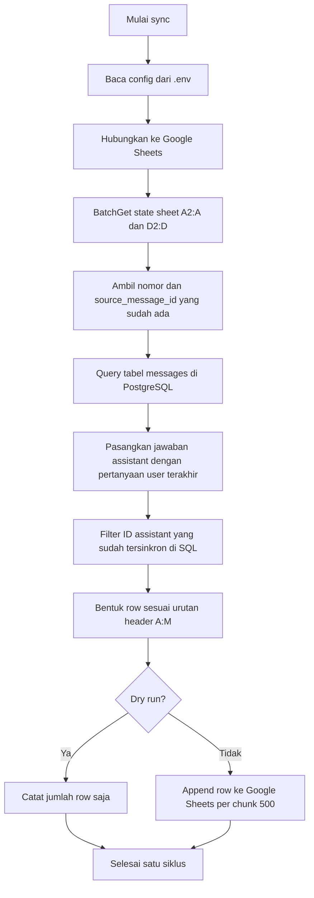

# Sync Flow

Dokumen ini menjelaskan alur data QA evaluation sync dari PostgreSQL ke Google Sheets.

## Sumber Data

Sumber data yang dipakai adalah tabel runtime:

- `messages` role `user`: pertanyaan pengguna.
- `messages` role `assistant`: jawaban sistem.
- `messages.debug.intent`: hasil intent classifier.
- `messages.debug.intent_confidence`: confidence intent classifier.
- `messages.debug.model`: model yang dipakai untuk generate jawaban.
- `messages.sources`: sumber/referensi RAG.
- `messages.created_at`: waktu message dibuat; yang ditulis ke sheet adalah `assistant.created_at`.

Pairing dilakukan dengan mencari message role `user` terakhir dalam session yang sama sebelum setiap message role `assistant`.

## Flowchart

Satu siklus sync berjalan seperti ini:



## QA Evaluation Sheet

Sheet QA evaluation merepresentasikan satu pasangan pertanyaan user dan jawaban assistant.

Mapping kolom:

```text
no                  -> nomor urut sheet, dihitung dari max(no) + 1
pertanyaan          -> messages.content dari role user
created_at          -> assistant.created_at, dikonversi ke WITA sebagai teks YYYY-MM-DD HH:MM:SS
source_message_id   -> messages.id dari role assistant
model               -> assistant.debug.model
jawaban             -> messages.content dari role assistant
sumber_referensi    -> messages.sources yang diformat menjadi teks rapi
labeled_by          -> kosong, diisi QA
intent_predicted    -> assistant.debug.intent + assistant.debug.intent_confidence, contoh: chitchat (0.76)
labeled_quality     -> kosong, diisi QA
notes_respond       -> kosong, diisi QA
labeled_intent      -> kosong, diisi QA
notes_intent        -> kosong, diisi QA
```

Dedup memakai `source_message_id` dari assistant message. Jika ID itu sudah ada di sheet, jawaban tersebut tidak di-append lagi.

`source_message_id` sengaja memakai UUID message `assistant`, bukan UUID message `user`, karena satu row sheet merepresentasikan satu jawaban yang dievaluasi. Kolom `created_at`, `model`, `jawaban`, `sumber_referensi`, dan `intent_predicted` semuanya berasal dari message `assistant`, sehingga UUID assistant menjadi anchor paling tepat untuk dedup dan traceback.

## Append-Only Behavior

Script hanya melakukan operasi append ke Google Sheets.

Yang tidak dilakukan script:

- Tidak update baris lama.
- Tidak delete baris.
- Tidak sort sheet.
- Tidak menulis ke PostgreSQL.
- Tidak mengubah schema database.

Karena itu, isi manual QA yang sudah ada di baris lama tidak hilang.

Append dilakukan per chunk 500 row. Jika satu siklus hanya memiliki 500 row baru atau lebih sedikit, script tetap mengirim 1 request append. Jika ada backlog lebih besar, row dibagi ke beberapa request append agar payload Google Sheets API tetap stabil.

Batas 500 row dipakai sebagai batas aman karena satu row QA dapat berisi teks panjang dan multi-line, terutama pada kolom `jawaban` dan `sumber_referensi`. Dengan chunk ini, sync tidak mengirim satu request sangat besar saat backlog menumpuk, tetapi jumlah request tetap rendah.

## Batas Google Sheets API

Pertimbangan read `batchGet` dan append chunk 500 mengikuti batas praktis Google Sheets API:

- Quota default Google Sheets API membatasi read dan write request per menit. Nilai default yang umum dipakai adalah 300 request per menit per project dan 60 request per menit per user per project untuk masing-masing kategori read/write.
- `values.batchGet` untuk membaca `A2:A` dan `D2:D` dihitung sebagai 1 read request.
- Setiap `values.append` dihitung sebagai 1 write request. Dengan chunk 500, 1.200 row baru menjadi 3 write request.
- Google Sheets API tidak memberi hard size limit tunggal untuk request, tetapi dokumentasi resminya merekomendasikan payload sekitar 2 MB agar request lebih cepat dan stabil.
- Jika quota request terlampaui, API dapat mengembalikan HTTP `429 Too Many Requests`. Jika satu request diproses lebih dari sekitar 180 detik, request dapat timeout.
- Referensi resmi: <https://developers.google.com/workspace/sheets/api/limits>

## Logic Pencegahan Duplicate Row

Script mencegah duplicate dengan membandingkan UUID jawaban assistant di database dengan `source_message_id` yang sudah ada di Google Sheets.

Flow:

```text
Google Sheets -> batchGet A2:A untuk nomor dan D2:D untuk source_message_id existing
PostgreSQL    -> baca kandidat message user/assistant yang belum tersinkron
Google Sheets -> append row baru per chunk 500
```

Pendekatan ini sederhana dan aman dari duplicate selama kolom `source_message_id` tidak dihapus/diubah.

Untuk data sangat besar, optimasi berikutnya bisa memakai query berbasis `created_at` terakhir dengan safety window, tetapi dedup tetap memakai `source_message_id`.

State sheet sengaja dibaca hanya dari kolom `A` dan `D`. Kolom `B` (`pertanyaan`) dan `C` (`created_at`) tidak diperlukan untuk sync state, sehingga tidak ikut terbawa dalam response Google Sheets API.

## Sumber Referensi

`messages.sources` diformat menjadi satu cell teks multi-line.

Format per sumber:

```text
1. file_name
Score: 0.9983
Chunk #0 - [narrative]
text_preview...
```

Jika tidak ada sources, cell `sumber_referensi` dibiarkan kosong.
